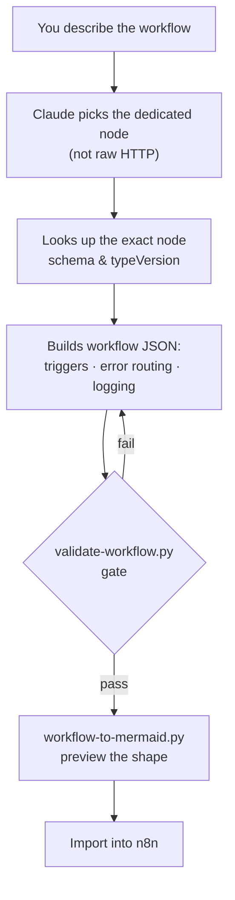
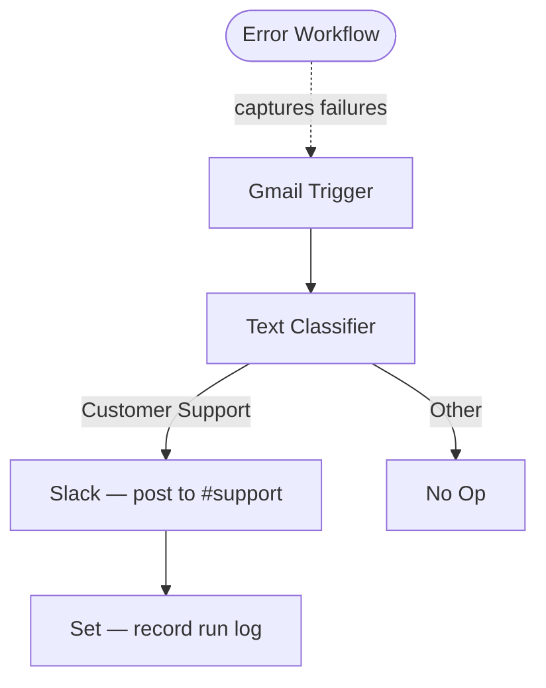

<div align="center">

# n8n-skill

### Turn Claude into a production-grade n8n workflow builder.

Stop hunting through thousands of workflow JSON files hoping one fits.
Install one skill and let Claude **build, validate, and ship** correct n8n
workflows on demand — wired with the right nodes, error handling, logging,
and security from the first try.


[Quick start](#quick-start) · [What you get](#what-you-get) · [How it works](#how-it-works) · [Example](#example) · [FAQ](#faq)

</div>

---

## Why this exists

Most n8n resources hand you a **pile of raw workflow JSON** and leave the hard
part to you: figuring out the right node for the job, pinning the correct
`typeVersion`, wiring error paths, keeping secrets out of the file, and making
the thing survive a flaky API at 3 a.m.

`n8n-skill` flips that. It's not a template pack — it's the **knowledge and
tooling that make Claude an n8n engineer.** You describe what you want; Claude
selects the right dedicated nodes, builds the workflow against real node
schemas, validates it before you ever import it, and ships it to production
standards.

---

## Quick start

```bash
git clone https://github.com/maybethereisone-C/n8n-skill ~/.claude/skills/n8n
# or: gh repo clone maybethereisone-C/n8n-skill ~/.claude/skills/n8n
```

Claude Code auto-discovers the skill. Then just ask:

> *"Build me a workflow that triages incoming Gmail with an AI classifier and
> posts customer-support emails to Slack — with error handling and run logging."*

Claude picks the nodes, builds the JSON, validates it, shows you the shape, and
hands you something import-ready.

---

## What you get

| | |
|---|---|
| 🧩 **540 built-in node schemas** | Every core + AI/LangChain node, each with its `typeVersion`, resources, operations, and full parameter list — so Claude builds against the *real* node, not a guess. |
| 📦 **2,390 import-ready templates** | Annotated reference workflows across 19 topic folders (AI agents, RAG, Gmail, Slack, Telegram, scraping, databases, and more). Secrets scrubbed to placeholders. |
| ✅ **6-rule production mandate** | A non-negotiable bar for every workflow Claude builds (see below). No toy flows that fall over in prod. |
| 🛠️ **Bundled tooling** | `validate-workflow.py` (catches import-breaking errors), `search-templates.py` (FTS over the library), `workflow-to-mermaid.py` (visualize any flow), `extract-schemas.py` (regenerate the catalog after an n8n upgrade). |
| 🔌 **Live-instance ops** | Operate a running n8n instance directly via MCP or the n8n REST API — not just author files. |
| 🐍 **Zero dependencies** | Scripts are Python **stdlib only**. No `pip install`, no lockfile, no supply chain. |

---

## How it works

Every workflow Claude builds has to clear **six rules** — the production mandate:

1. **Right node** — use the dedicated, credential-backed node, not HTTP-for-everything.
2. **Error handling** — error workflow, retries, and explicit failure routing.
3. **Logging & observability** — execution data plus a structured run log.
4. **Security** — no inline secrets, authenticated webhooks, SSRF/rate-limit guards.
5. **Pinned versions + validation** — locked `typeVersion`s, gated by `validate-workflow.py`.
6. **Resilience** — batching, checkpoint-resume, idempotency, dead-letter, backoff.

The build loop:



---

## Example

**Prompt:** *"Gmail → AI triage → Slack for support emails, with error handling."*

**What Claude builds:**



Pinned node versions, an attached error workflow, a run-log step, and a clean
pass through the validator — before it ever touches your instance.

---

## What's inside

```
n8n-skill/
├── SKILL.md                 # Router + the 6-rule production mandate
├── references/
│   ├── node-catalog.md      # Index of 540 nodes → per-node schemas in nodes/
│   ├── nodes/               # 540 individual node schemas (typeVersion, ops, params)
│   ├── nodes-deep.md        # Deep config for the most-used nodes
│   ├── node-selection.md    # Pick the dedicated node over raw HTTP
│   ├── workflow-schema.md   # n8n workflow JSON schema (v2.26.0)
│   ├── expressions.md       # Expressions: {{ }}, $json, $node, dates
│   ├── code-node.md         # Code node (JS/Python) + AI Code Tool
│   ├── ai-agent.md          # LangChain AI Agent architecture
│   ├── error-handling.md    # Error workflows, retries, Stop-And-Error
│   ├── resilience.md        # Long-running & flaky-job patterns
│   ├── logging-observability.md
│   ├── security.md          # Credentials, webhook auth, SSRF, RBAC
│   ├── production-checklist.md
│   ├── mcp-and-api.md       # Operate a live instance (MCP / REST API)
│   ├── community-nodes.md   # Reference for popular community nodes
│   ├── template-sources.md  # Sourcing guide for ready-made templates
│   ├── templates-catalog.md # Every bundled template, analyzed
│   └── category-taxonomy/   # Node categorization for fast lookup
├── templates/               # 2,390 import-ready workflows, 19 topic folders
└── scripts/                 # validate · search · mermaid · extract · index
```

---

## Updating after an n8n upgrade

The node catalog is source-extracted from an n8n checkout. After you upgrade
n8n, regenerate it:

```bash
python3 scripts/extract-schemas.py /path/to/n8n-source
python3 scripts/index-templates.py
```

---

## Requirements

- **Claude Code** (the skill auto-loads from `~/.claude/skills/`).
- **Python 3** for the bundled scripts — standard library only, nothing to install.

---

## FAQ

**Is this a template pack?**
No. The templates are reference material; the real value is the node knowledge,
the production mandate, and the tooling that let Claude *build and validate*
workflows for your exact need.

**Can Claude operate my self-hosted n8n, or just write files?**
Both. It authors import-ready JSON, and it can drive a live instance via MCP or
the n8n REST API.

**Will the workflows actually run in production?**
That's the whole point of the six-rule mandate — right nodes, error handling,
logging, security, pinned versions, and resilience baked in, not bolted on.

**Do I need API keys to use the skill?**
No keys to use the skill itself. You add your own n8n credentials when you
import a workflow — secrets are never stored in the files.

**Does it stay current with n8n?**
Yes — one command regenerates the entire node catalog from an n8n source
checkout after any upgrade.

---

## Contributing

Issues and PRs welcome — new node coverage, additional reference patterns, and
tooling improvements especially. Keep templates secret-free (placeholders only)
and run `validate-workflow.py` before submitting workflow JSON.

---

## License

The skill's references, schemas, and tooling are provided for building n8n
workflows. n8n itself is **fair-code** under the Sustainable Use License — keep
that in mind when you redistribute workflow content.

---

<div align="center">

If this saves you time, **star the repo** — it helps other builders find it.

[](https://star-history.com/#maybethereisone-C/n8n-skill&Date)

</div>
